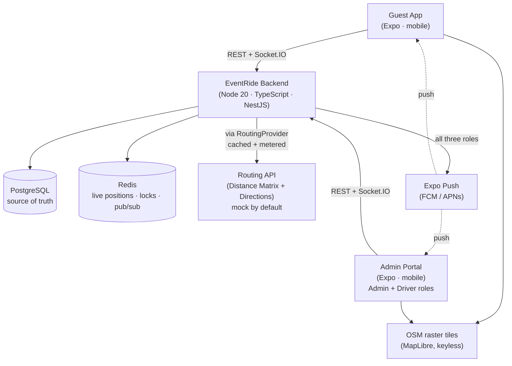
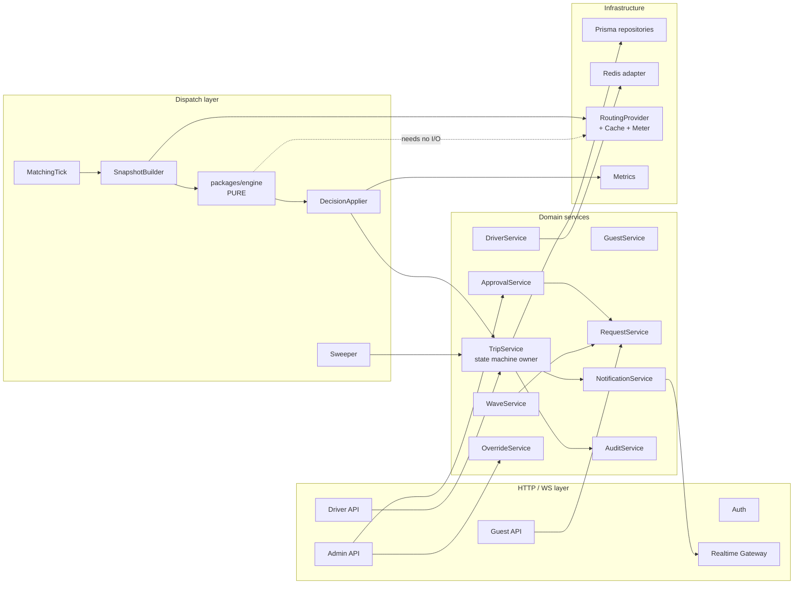
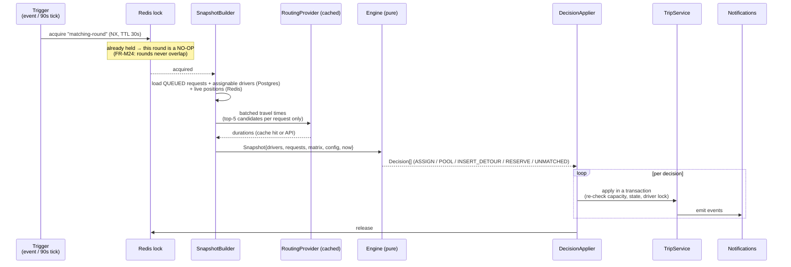
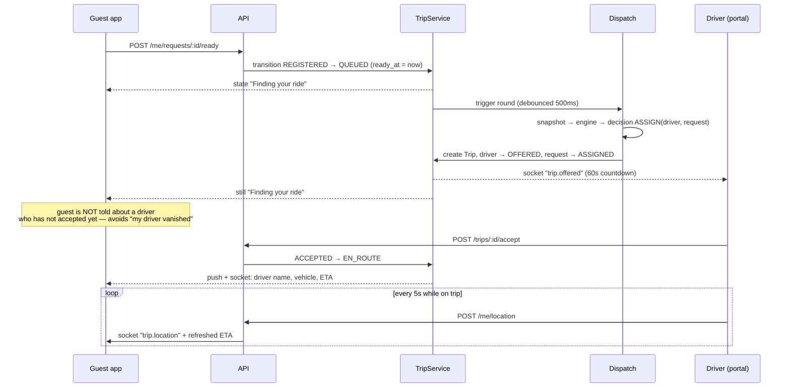
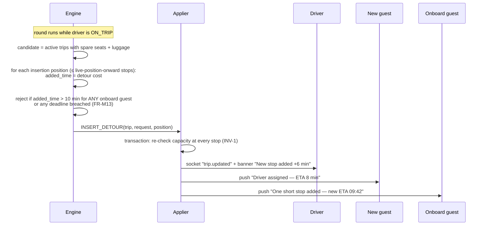
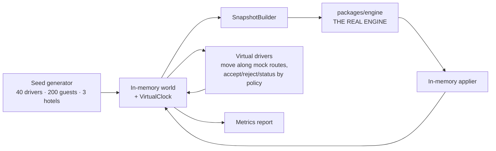

# HLD — Event Fleet Dispatch System ("EventRide")

**Version:** 1.0
**Date:** 2026-07-31
**Input:** [PRD.md](PRD.md) v1.0 (frozen). Every `FR-*`, `NFR-*`, `INV-*`, `D*` reference below points into that document.
**Purpose:** decide the architecture and the technology, and show that every PRD requirement has a home in it.

---

## 1. Architectural Drivers

The requirements that actually shape the architecture (everything else follows from these):

| Driver | Source | Architectural consequence |
|---|---|---|
| Allocation must be automatic, explainable, and testable | G5, FR-M23, INV-1…6 | The matching engine is a **pure, side-effect-free library** with an injected clock — not a service that reads the DB |
| Engine outage must not disrupt in-progress trips; override must always work | G7, NFR-3, D35 | **State lives in Postgres, not in the engine.** The engine only proposes; a thin applier commits. Override is a plain DB write path that bypasses the engine entirely |
| Ad-hoc match ≤ 5 s p95 | G6, NFR-2 | Feasibility filtering happens **in memory** over a snapshot; at most one routing API call per matching decision |
| Third-party API spend must be bounded and provable | NFR-4, D34 | Routing sits behind a **provider interface** with a caching decorator; call counts are metered and asserted in tests |
| A driver must never see another driver's data | NFR-6, §5.1 | RBAC enforced by **guards + a row-scoping rule** applied in the service layer, not the controller |
| Peak-arrival behaviour must be demonstrable | §19 | Because the engine is pure, the **simulation runs the real engine in-process** with a virtual clock — no mock engine, no divergence between demo and production logic |
| All timers (offer expiry, no-show, auto-queue, break due, SLA) | D32, FR-M26 | **One sweeper loop**, not N scheduled jobs. Restart-safe because it recomputes from DB state each tick |

---

## 2. Technology Decisions

Each with the alternative I rejected and why. Optimised for *one developer shipping this in ~2 weeks* while still satisfying every requirement.

| ID | Decision | Rejected alternative | Why |
|---|---|---|---|
| T1 | **TypeScript everywhere** (backend, both frontends, engine, simulation) | Python/Go backend | One language means the engine's domain types are shared verbatim with both UIs via a `shared` package. No DTO drift, no second toolchain. |
| T2 | **Monorepo, pnpm workspaces** | Separate repos per app | Submission is a single public repo. Shared types and one `docker-compose up` are worth far more than repo isolation here. |
| T3 | **Backend: NestJS** (Node 20) | Bare Express / Fastify | RBAC is an explicitly scored criterion. Nest's `Guard` abstraction makes role + row-scope enforcement declarative and uniform (`@Roles('ADMIN')`), and DI makes the routing provider and clock trivially swappable for tests. Express would mean hand-rolling all of that. |
| T4 | **MySQL 8.4 (InnoDB) + Prisma** | MongoDB · PostgreSQL | The data is relational and invariant-heavy (capacity sums, one-active-trip-per-driver, FK integrity), so we need transactions, `SELECT … FOR UPDATE` row locks (FR-M24) and CHECK constraints — InnoDB provides all three. Prisma gives typed queries + migrations with near-zero ceremony on MySQL. See §2.2 for the three places MySQL differs from Postgres and how each is handled. |
| T5 | **No spatial types** — haversine in memory | MySQL spatial indexes | At ≤ 100 drivers, "nearest 5 drivers" is a 100-element sort in microseconds. A spatial column plus index tuning would buy nothing at this scale. |
| T6 | **Redis** for live driver positions, the matching-round lock, and Socket.IO pub/sub | MySQL for everything | Position pings are high-frequency, low-value writes (every 5 s × 100 drivers); they must not bloat the audit-grade MySQL tables. Redis is also the cleanest single-flight lock (FR-M24). *Position history* still goes to MySQL, sampled at 30 s, for the audit trail. |
| T7 | **Socket.IO** for realtime fanout | Raw WebSocket / SSE / polling | Rooms map exactly onto our authorisation model (`driver:<id>`, `guest:<id>`, `admins`), and the automatic polling fallback covers hotel wifi. |
| T8 | **Guest app: React Native (Expo)** | Flutter / mobile PWA | The brief says "guest mobile app". Expo gives real push notifications, background-capable geolocation, and Expo Go review without a store build. Flutter would mean a second language (T1). |
| T9 | **Admin Portal: also React Native (Expo) — one mobile app containing BOTH the Admin and Driver roles** | React web portal · a separate native driver app | **All three roles are mobile apps** (see §2.1). This keeps the brief's structure exactly — Guest app and Admin Portal remain two separate applications, and the portal holds both roles behind RBAC — while giving the driver real background location and native push, which a mobile browser cannot do reliably. Both apps share `packages/ui`, so there is still only one component vocabulary. |
| T10 | **Push: Expo Push (FCM/APNs) for all three roles** | Web Push / socket-only for the portal | With the portal native, every role gets real push. This matters most for the driver's 60-second offer window (FR-D5) and for admin critical alerts (FR-A4) — neither can depend on an app being foregrounded. Socket remains the low-latency channel while foregrounded; push is the reachability channel. |
| T17 | **Maps: MapLibre + OpenStreetMap raster tiles by default, Google Maps SDK swappable** | `react-native-maps` with Google as the only option | Map *rendering* would otherwise need a Google Maps SDK key even when the *routing* provider is the mock (T11) — meaning reviewers could not run the app keyless. MapLibre with OSM tiles renders with no key and no billing account, and the map component is isolated behind `<FleetMap>` / `<TripMap>` so switching to Google is a one-file change. |
| T11 | **Routing: `RoutingProvider` interface** with three implementations — `GoogleMapsProvider`, `CachingProvider` (decorator), `HaversineMockProvider` | Calling Google directly from the engine | Serves NFR-4 and D34: tests and the simulation run on the mock at zero cost, the cache is a decorator (so caching is testable in isolation), and swapping vendors touches one file. |
| T12 | **Auth: JWT with role claims; phone+OTP for guests and drivers, password for admin** | OAuth / a managed auth vendor | Event-scoped, closed population. Dev mode accepts a fixed OTP (`000000`) so reviewers can log in as any seeded user without SMS spend. |
| T13 | **Sweeper + matching tick via `@nestjs/schedule`** | BullMQ / Agenda job queue | Every timer in the system is "scan for rows whose deadline has passed" — inherently idempotent and restart-safe. A job queue would add durable-job state we'd then have to reconcile after a crash (D32). |
| T14 | **Simulation runs the real engine in-process against an in-memory repository with a virtual clock** | Driving the HTTP API with a sped-up clock | Wall-clock-driven HTTP simulation can't compress 6 hours of arrivals into seconds, and it would test the transport instead of the logic. Because the engine is pure (T15), the simulated engine *is* the production engine. |
| T15 | **Engine as a dependency-free package** (`packages/engine`): `(snapshot, config, now) → Decision[]` | Engine as a Nest service reading Prisma | The single most important structural decision. It makes the engine unit-testable without a DB, replayable in the simulator, and the invariants (INV-1…6) become pure-function property tests. It also means an engine crash cannot corrupt state — it produces a proposal that a transactional applier validates before committing. |
| T16 | **Deployment: docker-compose** (postgres, redis, api) + Expo Go for both mobile apps | Kubernetes / serverless | Reviewers must run this in one command. Single-instance is well inside NFR-1 (100 drivers). |

### 2.1 All three roles are mobile apps — what that changes

**Decision:** Guest app = Expo mobile app. Admin Portal = Expo mobile app containing **both** the Admin/Ops and
Driver roles behind RBAC. Two applications, exactly as the brief specifies (guest separate, driver inside the portal),
with the brief's "mobile or web" choice for the portal resolved to **mobile**, consistent with its "mobile-first" framing.

| Consequence | Detail |
|---|---|
| **Driver background location improves** | `expo-location` background task runs while a trip is active — real background tracking instead of a foregrounded browser tab. PRD D17 is upgraded accordingly (still best-effort if the OS kills the app). |
| **Push for every role** | Native Expo Push for guest, driver and admin. The driver's 60 s offer window (FR-D5) and admin critical alerts (FR-A4) no longer depend on an app being open. |
| **Admin screens must be redesigned mobile-first** | The dense admin views (driver table, exception queue, config, round detail) become card lists + bottom-sheet filters, with the live map as the primary screen. Specified in LLD §8.2. |
| **Tablet/landscape layout** | Ops staff typically run the event from a tablet on a desk; the portal ships a two-pane landscape layout (list + map) for ≥ 768 dp. |
| **Web build as a free bonus** | Expo's `react-native-web` target produces a browser build of the *same* portal codebase, so ops can open it on a laptop. Not a separate deliverable, not a separate codebase — just an extra output of `expo export`. |
| **Shared component library** | Because both apps are React Native now, `packages/ui` holds the shared primitives (buttons, status pills, map wrappers, sheets). One component vocabulary across both apps. |
| **Map rendering needs no API key** | MapLibre + OSM raster tiles (T17), so a reviewer with no Google account still sees maps in both apps. |

**The trade-off I flagged and the user accepted:** an ops coordinator managing 40 drivers and 200 guests is a
desk-shaped task, and a phone screen is a worse surface for it than a laptop. The mitigations above (tablet layout,
web build from the same code) recover most of that without adding a codebase.

### 2.2 MySQL specifics — three real differences, each handled

MySQL is a clean fit for this workload, but it lacks three Postgres features the original schema leaned on. Each has
a first-class MySQL equivalent; none of them weakens an invariant.

| Gap | Consequence | How we handle it |
|---|---|---|
| **No partial / filtered unique indexes** | The original enforcement of INV-5 ("one active trip per driver") was `UNIQUE (driver_id) WHERE state IN (active…)`. MySQL cannot express that. | **Generated column + unique index.** `active_driver_id` is a `STORED` generated column equal to `driver_id` when the trip state is active and `NULL` otherwise; a plain `UNIQUE` index on it enforces the rule, because MySQL permits unlimited `NULL`s in a unique index. **INV-5 is still enforced by the database, not by application code** — which was the whole point. (Alternative considered: a separate `driver_active_trip` table keyed by `driver_id`. Rejected as an extra write per transition.) |
| **No timezone-aware timestamp type** (`DATETIME` has no offset; `TIMESTAMP` silently converts) | NFR-9 requires "store UTC, display event-local". A wrong session timezone would silently shift every deadline. | All columns are `DATETIME(3)` holding **UTC only**. The connection string pins `timezone=UTC` (`SET time_zone='+00:00'`), the Prisma client is the only writer, and a startup assertion fails fast if the server session timezone is not UTC. Local-time rendering happens in `packages/shared` using the event's IANA timezone — never in SQL. |
| **`JSON` type has no `jsonb` indexing** | `config`, `score_breakdown`, `decisions`, `rejections` are JSON columns. | We only ever read these blobs whole (never query inside them), so no index is needed. Validation happens with zod at the application boundary, which was already the design. |

Two smaller adjustments:

- **Partial index on the hot queue** (`WHERE state='QUEUED'`) becomes a plain composite index on `(state, ready_at)`. Same access path for the round's hot query.
- **Isolation level:** the applier's connection runs `READ COMMITTED` rather than MySQL's default `REPEATABLE READ`. Under REPEATABLE READ, InnoDB's gap locks on the frequently-scanned `trip_request(state, ready_at)` index would create avoidable lock contention between the matching round and concurrent driver status updates. Row-level `FOR UPDATE` locks still give us the double-booking protection FR-M24 needs.
- **L2 degradation** (§10): the fallback round lock becomes `GET_LOCK('matching-round', 0)` / `RELEASE_LOCK(...)` instead of a Postgres advisory lock. Same semantics, session-scoped, released automatically if the connection dies.

---

## 3. System Context



**Trust boundary:** every client is untrusted. All state transitions are validated server-side against the state machines in PRD §6.3 (NFR-8, INV-6). Clients send *intents* (`POST /trips/:id/status`), never states.

---

## 4. Backend Module Decomposition



**Rules that keep this clean:**

1. **`TripService` is the only writer of trip/request state.** Everything else (driver action, admin override, engine decision, sweeper timeout) calls it. That is where the state machine and the invariants are enforced — one place, always.
2. **`packages/engine` imports nothing.** No Prisma, no HTTP, no `Date.now()`. It receives a snapshot, a config, and `now`.
3. **`SnapshotBuilder` is the only component that performs routing calls** during a matching round, so the call budget is enforceable and measurable in exactly one place (NFR-4).
4. **`DecisionApplier` re-validates every decision inside a transaction** before committing. The engine is trusted for quality, never for correctness.

---

## 5. The Dispatch Layer (the core)

### 5.1 Round structure



**Triggers** (all funnel into the same round, PRD FR-M3): the 90 s tick · a request becoming `QUEUED` · an ad-hoc approval · a driver reject or offer expiry · a driver going online / finishing a trip / ending a break · a breakdown · an admin guest edit · a wave dispatch.

Event-triggered rounds are **debounced by 500 ms** so a burst of 80 simultaneous arrivals produces one good round rather than 80 greedy ones — this is what makes the peak scenario behave well.

### 5.2 Why the engine is pure — and what it buys

| Consequence | Requirement served |
|---|---|
| Unit-testable without a DB, HTTP, or maps key | INV-1…6 become property tests |
| The simulator runs the **production** engine | §19 — demo and reality cannot diverge |
| An engine exception aborts a *proposal*, not a transaction | G7, NFR-3 |
| Decisions carry their score breakdown as data | FR-M23, FR-A11 |
| Re-running an identical snapshot yields identical decisions | debuggability: a bad round is reproducible from its logged snapshot |

**Deliberately inside the engine:** feasibility filtering, cost scoring, priority + aging + force-to-front, pooling, group splitting, detour insertion, soft reservation, break-window awareness.
**Deliberately outside the engine:** persistence, routing calls, notifications, RBAC, approvals — all I/O and all human policy.

### 5.3 Three entry points, one scorer (PRD D21)

| Entry point | Candidate set | Algorithm | Where |
|---|---|---|---|
| **Real-time** (FR-M2) | 1 request × feasible drivers | filter → score → best | `matchIncremental()` |
| **Batch** (FR-M1) | N requests × M drivers | Hungarian (LAP) on the cost matrix, then a greedy pooling pass | `planBatch()` |
| **Re-optimise** (FR-M3) | pending (not-yet-accepted) requests only | `planBatch()` over the pending set + detour insertion over active trips | `reoptimise()` |

All three call the identical `score(driver, request, ctx)` and the identical `isFeasible(...)` hard filter. Only the candidate-set size differs.

### 5.4 Sweeper (one loop, 10 s interval — D32)

| Check | Action |
|---|---|
| Offer older than `offer_expiry_sec` | auto-reject → requeue → trigger round |
| `ARRIVED_PICKUP` older than `no_show_wait_min` | expose "guest not found" to the driver; alert admin |
| Scheduled request past `scheduled_time + auto_queue_fallback_min`, still not ready | auto-queue it (FR-G4) |
| Driver past `break_after_driving_min` / `break_after_trips` | mark break due; exclude from assignment |
| Driver past `max_duty_hours` | force `OFFLINE`, alert admin |
| Queued request past wait warn / critical | raise admin alert (FR-A4) |
| Wave departure time reached | dispatch the wave |
| Driver position stale > 2 min while on a trip | stale-location warning to admin (E20) |

Restart-safe by construction: every check is a query over current DB state, holding no memory of previous ticks.

---

## 6. Key Flows

### 6.1 Guest becomes ready → assignment



**Design point:** the guest is notified on **accept**, not on **offer**. A rejected offer then stays invisible to the guest (PRD §15: "Driver rejected → silent"), so the guest never sees a driver appear and disappear.

### 6.2 Driver rejects

```
reject(reason) → Trip CANCELLED_BY_DRIVER
               → request REQUEUED, priority_score bumped, passed_over_count++
               → cooldown(driver, request, 15 min) written to Redis
               → driver back to AVAILABLE
               → trigger round (the same driver is now filtered out for this request)
               → 2nd consecutive reject by this driver → admin alert
```

The cooldown lives in Redis with a TTL, so it expires by itself — no cleanup job (D32 in spirit).

### 6.3 Mid-trip detour insertion (FR-M18, E12)



Bounded by design (D24): **max 1 inserted stop per active trip**, and insertion positions are only those *after the driver's live position*. So the search is a linear scan over remaining stops — cheap enough to run every 90 s for every active trip.

### 6.4 Ad-hoc request (the manual/automatic boundary — FR-M25)

```
Guest submits → PENDING_APPROVAL → admin alert
Admin approves → request QUEUED → trigger round → engine picks the driver
Admin declines → DECLINED + reason → shown to guest
```

The admin approves **entry**, never the driver choice. The API has no endpoint that lets an admin choose a driver during approval — the only way to name a driver is the separate, reason-mandatory override endpoint (FR-A9). Enforcing the boundary in the API surface, not in the UI, is what makes G5 real.

### 6.5 Breakdown mid-trip (E5)

```
Driver reports breakdown → driver UNAVAILABLE
  → onboard requests REQUEUED at top priority,
    origin rewritten to the driver's LAST KNOWN POSITION (not the original pickup)
  → guests: "Reassigning your ride"
  → admin: critical alert
  → immediate round
```

Rewriting the origin to the live position is the detail that makes recovery actually work — re-dispatching to the original pickup point would send a rescue vehicle to the wrong place.

---

## 7. Realtime Design

| Room | Members | Events |
|---|---|---|
| `guest:<guestId>` | that guest only | `request.state`, `trip.assigned`, `trip.location`, `trip.eta`, `trip.completed` |
| `driver:<driverId>` | that driver only | `trip.offered`, `trip.updated`, `trip.cancelled`, `break.granted` |
| `admins` | all admin-role users | `driver.position`, `driver.status`, `request.state`, `alert.*`, `metrics.tick` |

**Authorisation at subscribe time:** the socket handshake carries the JWT; the gateway derives room membership from the token and **ignores client-requested rooms entirely**. A driver cannot subscribe to `admins` or to another driver's room even by crafting the payload (NFR-6).

**Fanout throttling:** driver positions are batched and emitted to the `admins` room at **1 Hz aggregate** (one message containing all moved drivers), not once per driver per ping. 100 drivers × 5 s pings = 20 msg/s inbound compressed to 1 msg/s outbound.

---

## 8. Routing & API Cost Control (NFR-4)

### 8.1 Layering

```
Engine  →  never calls routing
SnapshotBuilder → RoutingProvider (interface)
                   └─ MeteringProvider   (counts calls, exposes /metrics)
                       └─ CachingProvider
                           ├─ StaticMatrixCache  (POI × POI, permanent)
                           └─ LiveCache          (Redis, TTL 300 s)
                               └─ GoogleMapsProvider | HaversineMockProvider
```

### 8.2 Rules

| Rule | Effect |
|---|---|
| POI × POI matrix pre-computed once at boot | 6 POIs → 36 elements → **1 request for the entire event**. Every accommodation/venue/airport pair is then free forever |
| Live-traffic calls only for the **top-5 candidates** (`candidate_topk_for_live_eta`) | Candidates are pre-ranked by haversine, so we pay for 5 lookups, not 100 |
| Cache key = `(origin snapped to a 50 m grid, destination, 15-min traffic bucket)` | Two drivers 30 m apart, 3 minutes apart, share one cached answer |
| Active-trip ETAs batched, 25 origins per Distance Matrix request | 100 active trips = **4 calls per tick** |
| Route polyline fetched **once per trip** via Directions and cached; ETA refreshes use Distance Matrix only | A 40-minute trip costs 1 Directions call, not 27 |
| `HaversineMockProvider` used by all tests and the simulator | 0 API calls in CI and in the peak-scenario demo |

### 8.3 Measured budget at designed peak

| Source | Calls/hour |
|---|---|
| Static POI matrix | 1 (once, ever) |
| New-request matching (80 requests/hr, 1 batched call each) | ~80 |
| Active-trip ETA refresh (40 ticks/hr × 4 batched calls) | ~160 |
| Trip polylines (1 per trip) | ~80 |
| **Total** | **≈ 320 calls/hour at peak** |

This number is exported as a metric and asserted with a ceiling in an integration test, so "efficient use of external APIs" is a demonstrated fact rather than a claim.

### 8.4 Fallback (NFR-3 level 1)

Routing API failing or over quota → `CachingProvider` serves stale entries past their TTL; on a total miss it falls back to `haversine × 1.4 ÷ 30 km/h`, and every ETA derived this way is tagged `estimated: true` and rendered as **"~14 min (estimated)"** in both UIs. Dispatch keeps working; only precision degrades.

---

## 9. Consistency & Concurrency

| Risk | Mitigation |
|---|---|
| Two rounds double-book a driver | Redis lock `matching-round` (NX, TTL 30 s); a second trigger is a no-op (FR-M24) |
| Applier commits a decision built on a stale snapshot | Every apply is a transaction that re-reads the driver `FOR UPDATE`, re-checks status + capacity + INV-5, and **skips the decision** if reality moved. Skips are logged and the next round re-plans |
| Driver accepts a trip that was just reassigned | `Trip.version` optimistic-lock column; the loser gets `409 TRIP_STALE` and the UI refreshes |
| Duplicate client requests (double tap, retry) | Mutating endpoints accept an `Idempotency-Key`; the applier is naturally idempotent because it is state-machine-guarded |
| Sweeper and round act on the same row | Both go through `TripService`, whose transitions are guarded by the state machine; an illegal transition throws rather than corrupts |
| Capacity violated by a race | Enforced **three times**: engine filter, applier transaction re-check, and a DB `CHECK` on the trip-load rollup. INV-1 cannot be violated by any single bug |

---

## 10. Degradation Ladder (NFR-3, G7)

| Level | Failure | Behaviour | Still works |
|---|---|---|---|
| L1 | Routing API down / over quota | Stale cache → haversine estimate, ETAs marked "estimated" | Everything, at lower precision |
| L2 | Redis down | Positions fall back to `last_location` on the driver row (30 s sampled); rounds fall back to a Postgres advisory lock; socket fanout becomes single-instance | Dispatch, tracking (coarser) |
| L3 | Engine throws / dispatch loop dead | Rounds stop producing decisions; **in-progress trips continue untouched** (state is in Postgres, driver app unaffected); new requests accumulate in `QUEUED` durably and drain on recovery; admin sees "auto-dispatch degraded" banner | Driver app, guest tracking, **admin manual override** |
| L4 | Push service down | Socket + in-app state still updates; guest sees fresh state on open | All in-app flows |
| L5 | API down | Guest and driver see cached last-known state with a "last updated hh:mm" stamp (FR-G14) | Ops fall back to the helpdesk phone number |

**The invariant across all levels:** manual override (FR-A9) is a plain, transactional DB write that never calls the engine, the routing provider, or Redis. It is the last line of defence on event day, so it depends on the fewest things.

---

## 11. Security & RBAC

```
JWT claims: { sub, role: ADMIN|DRIVER|GUEST, driverId?, guestId?, eventId }
```

Three enforcement layers, all server-side:

1. **`RolesGuard`** — endpoint-level. `@Roles('ADMIN')` on every admin controller. A driver token gets `403` before any handler runs.
2. **Row scoping in the service layer** — driver and guest services never accept a caller-supplied owner id. `TripService.getCurrentForDriver(token.driverId)` derives the id from the token, so there is no `id` parameter to tamper with. Admin-only services take ids; role-scoped ones do not.
3. **Socket room derivation from the token** (§7) — clients cannot choose their rooms.

Additional: passwords bcrypt-hashed; OTPs single-use with a 5-minute TTL and rate limiting; the audit log is append-only (no update/delete path exists in the repository layer); driver positions are purged after the event window + audit period (NFR-10); the driver API response for a trip **omits the guest's phone number entirely** (D9) — it is not sent to the client and then hidden, it is never serialised.

**Test-enforced:** a parametrised authorisation test walks every admin route with a driver token expecting `403`, and every driver route with driver B's token on driver A's trip expecting `403`. This is the criterion "clean role separation" made mechanical.

---

## 12. Observability (NFR-7)

| Signal | Content |
|---|---|
| **Decision log** (one structured record per round) | round id, trigger, snapshot digest, per-decision score breakdown + runner-up, and **every rejected (driver, request) pair with its typed reason** — this is what proves G2 |
| Metrics | queue depth, wait p50/p95/max, idle-driver-minutes-while-queue-non-empty, capacity violations (expected 0), deadline misses, round duration, routing calls, socket clients |
| Alerts surfaced in the admin UI | wait SLA breach, unmatched, fleet shortfall, stale driver position, driver duty cap, 2 consecutive rejects |
| Audit trail | every state change with actor + reason (FR-A16, D36) |

Round duration and routing-call count are both asserted in tests, tying NFR-2 and NFR-4 to CI rather than to hope.

---

## 13. Simulation Architecture (§19)



The clock is injected, so a 6-hour arrival curve replays in seconds. Virtual drivers have configurable behaviour (reject rate, status-update lag, one breakdown) so the peak scenario exercises the exception paths, not just the happy path. The report prints the §19.3 metrics and **exits non-zero if capacity violations > 0 or `max_passed_over_count` > 3** — the invariants become a CI gate.

Same engine, same config, same cost function as production. Only the world and the clock are fake.

---

## 14. Repository Layout

```
eventride/
├─ apps/
│  ├─ api/            NestJS backend (Node 20 + TypeScript)
│  ├─ guest/          Expo mobile app — guest role only
│  ├─ portal/         Expo mobile app — Admin + Driver roles (also builds to web via expo-web)
│  └─ sim/            CLI: seed + peak-scenario simulation + metrics report
├─ packages/
│  ├─ engine/         PURE matching engine (no I/O, injected clock)
│  ├─ shared/         zod schemas, domain types, enums, state machines, config defaults
│  ├─ ui/             shared React Native components (both apps): buttons, status pills,
│  │                  map wrappers, bottom sheets, ETA text
│  ├─ api-client/     typed REST + socket client generated from packages/shared
│  └─ routing/        RoutingProvider interface + Google / Caching / Mock / Metering
├─ docs/              PRD.md · HLD.md · LLD.md · DESIGN-matching.md
├─ docker-compose.yml
└─ README.md
```

`packages/shared` holds the state-machine transition tables and the §12 config defaults, so backend, both UIs, and the simulator are physically incapable of disagreeing about what a legal transition or a default threshold is.

---

## 15. Requirement → Component Traceability

| PRD area | Realised by |
|---|---|
| FR-G1…G15 | `apps/guest` + Guest API + Realtime gateway |
| FR-A1…A16 | `apps/portal` (admin role) + Admin API + OverrideService + ApprovalService + WaveService |
| FR-D1…D13 | `apps/portal` (driver role) + Driver API + browser geolocation |
| FR-M1…M26 | `packages/engine` (M9–M23) + Dispatch layer (M1–M3, M24, M26) + WaveService (M4–M8) |
| §12 config | `packages/shared/config` + `event_config` row + admin config screen |
| NFR-3 | §10 degradation ladder |
| NFR-4 | `packages/routing` + §8 |
| NFR-6 | §11 three-layer RBAC |
| NFR-7 | §12 observability |
| INV-1…6 | Engine property tests + applier transaction + DB constraints |
| §19 demonstrability | `apps/sim` |

Every PRD requirement has exactly one owning component. Nothing is orphaned, nothing is duplicated.

---

## 16. Known Architectural Trade-offs

1. **Single API instance.** Well inside NFR-1. Horizontal scaling would need the Redis Socket.IO adapter (already the design) and the round lock (already Redis) — so scaling out is possible but untested; stated as a limitation.
2. **Batch = LAP + greedy pooling, not a VRP solver** (D29). Provably optimal for 1:1 assignment, near-optimal once pooled. The `planBatch()` signature is the seam where OR-Tools could be dropped in later.
3. **Driver location via browser geolocation** (T9). Requires the trip page to stay open — an explicit product decision (D17), not an oversight. A native driver app is the obvious upgrade path.
4. **Redis is a hard dependency for the best experience**, a soft one for correctness (L2 fallback exists).
5. **Debounced rounds add up to 500 ms of latency** to a single request in exchange for far better decisions during bursts. Well inside the 5 s p95 budget (G6).
6. **The engine re-plans from a full snapshot each round** rather than maintaining incremental state. At 100×500 this costs milliseconds and eliminates an entire class of stale-cache bugs.

---

## 17. Next

[LLD.md](LLD.md) — schema, API contracts, engine pseudocode with complexity, transition tables, screen specs, test plan.
